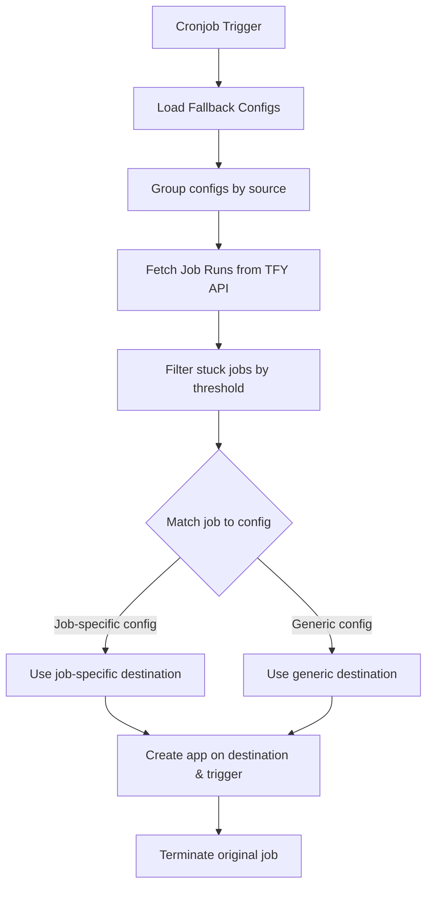

# Job Fallback Cronjob Service

## Overview

The Job Fallback Scheduler is a background service that periodically checks for stuck jobs and automatically moves them from a source cluster/workspace to a destination cluster/workspace based on fallback configurations.

## Architecture

## How It Works

1. **Load Configurations**: Reads all fallback configurations from the database/storage
2. **Group by Source**: Groups configs by source cluster + workspace
3. **Fetch Job Runs**: Calls TrueFoundry API to get jobs with `CREATED` status
4. **Detect Stuck Jobs**: Filters jobs that have been in `CREATED` status longer than the threshold
5. **Match Config**: Finds the appropriate fallback config for each stuck job
6. **Move Job**: Creates application on destination, triggers job, terminates source job

## Configuration Priority

Fallback configurations are matched with the following priority:

1. **Job-specific configs** (have `sourceJobId`): If a config specifies a particular job ID, it only applies to that job
2. **Generic configs** (no `sourceJobId`): Apply to all jobs in the source cluster/workspace

When a stuck job is found:
- First, check if any job-specific config matches the job's `applicationId`
- If found, use that config's destination
- If not found, use the first generic config for that source (if any)

## Important: Workspace FQN

The fallback config stores `destinationWorkspaceFqn` directly. This eliminates the need for an extra API call during job moves. When creating/editing a fallback config from the frontend, the workspace FQN is automatically captured from the selected workspace.

**If you have existing configs without `workspaceFqn`:** Edit and re-save them through the frontend to populate this field.

## Environment Variables

| Variable | Description | Default |
|----------|-------------|---------|
| `TF_SERVICE_API_TOKEN` | **Required** - Service-level TrueFoundry API token for cronjob authentication | - |
| `TF_USER_API_TOKEN` | User-level TrueFoundry API token (for local development fallback in controllers) | - |
| `JOB_FALLBACK_ENABLED` | Enable/disable the scheduler | `false` |
| `JOB_FALLBACK_STUCK_THRESHOLD_MINUTES` | Time threshold (in minutes) to consider a job stuck | `60` |

## Cron Schedule

The scheduler runs every 5 minutes by default (using `CronExpression.EVERY_5_MINUTES`).

## Authentication

The cronjob runs without user context, so it requires a **service-level token** (`TF_SERVICE_API_TOKEN`) for TrueFoundry API calls. This is different from the user-level token used in controller fallbacks.

The scheduler will:
- Skip execution if `JOB_FALLBACK_ENABLED` is `false`
- Log a warning and skip if `TF_SERVICE_API_TOKEN` is not configured

## Key Files

- `backend/src/modules/cluster-fallback-config/job-fallback-scheduler.service.ts` - Main scheduler service
- `backend/src/modules/external-data/external-data.service.ts` - TrueFoundry API methods
- `backend/src/modules/cluster-fallback-config/cluster-fallback-config.service.ts` - Fallback config storage

## Enabling the Service

1. Set `TF_SERVICE_API_TOKEN` with a valid service account token
2. Set `JOB_FALLBACK_ENABLED=true`
3. Optionally adjust `JOB_FALLBACK_STUCK_THRESHOLD_MINUTES` (default: 60)
4. Restart the backend service

